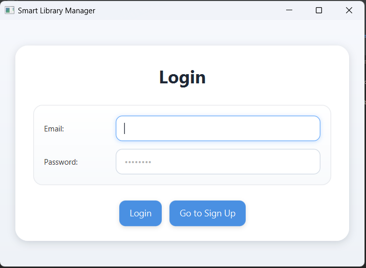
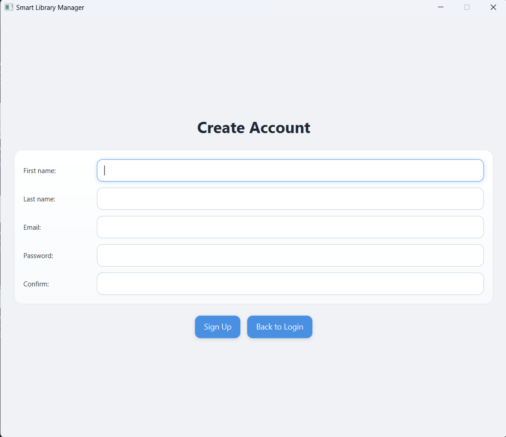
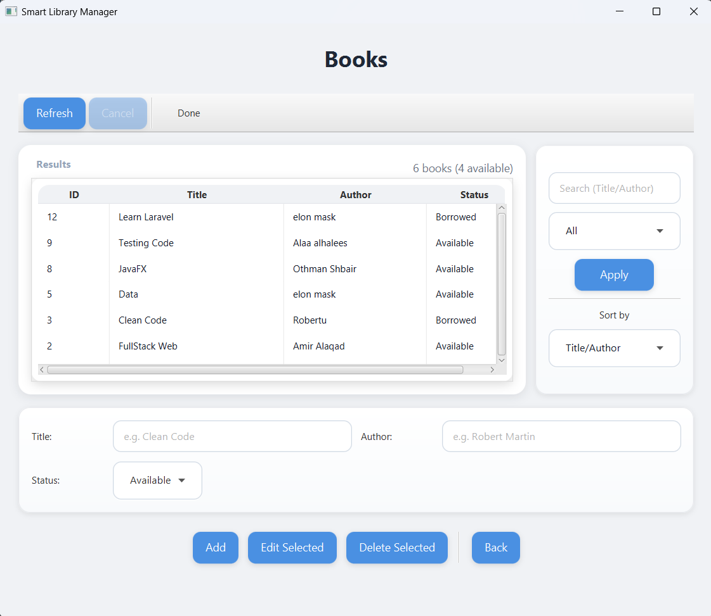
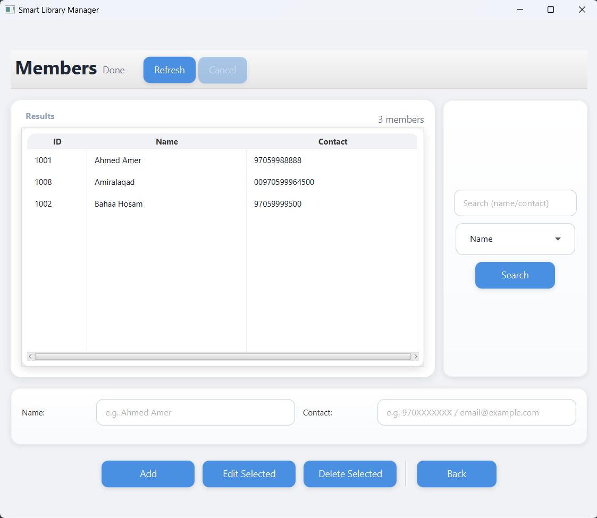
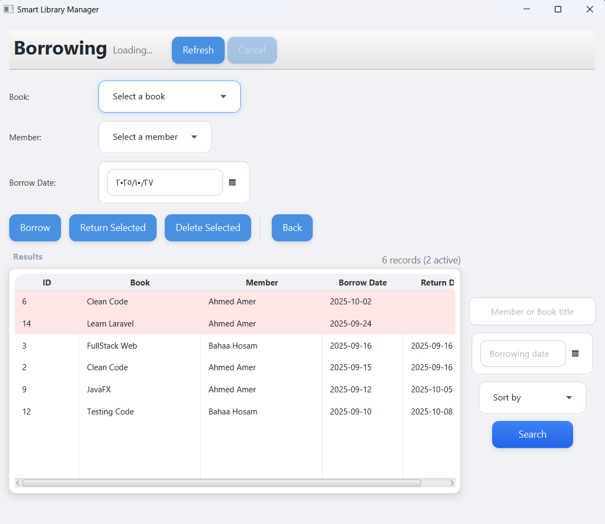
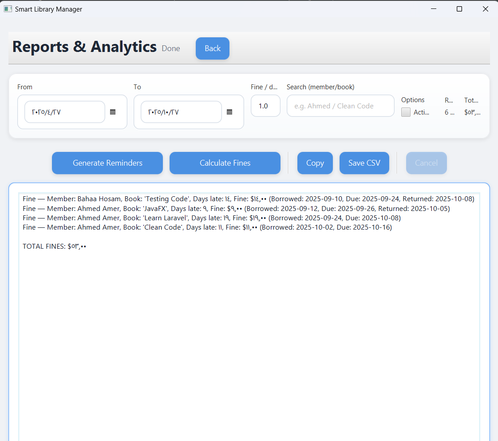
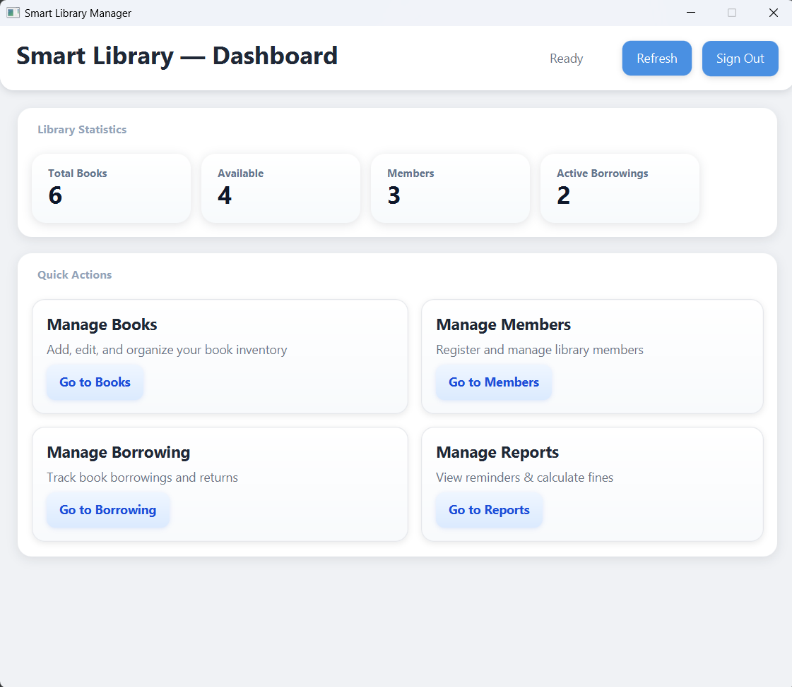

# 📚 Smart Library Manager System

A powerful **JavaFX-based Library Management System** designed to help librarians organize and manage books, members, and borrowing processes efficiently.  
This project uses **MySQL** as the main database and follows a clean MVC architecture with FXML-based UI.

---

## 🚀 Features

- 🔐 **User Authentication** — login and registration system for admins and users.  
- 📘 **Book Management** — add, edit, delete, and search for books.  
- 👥 **Member Management** — register, update, or remove library members.  
- 🔄 **Borrowing System** — borrow and return books with real-time status.  
- 📊 **Dashboard Overview** — view statistics and system summaries.  
- 💾 **Data Persistence** — MySQL database integration with optional local file backup.  
- 🎨 **Modern Interface** — built with JavaFX, FXML, and CSS styling.

---

## 🏗️ Project Structure

- 📁 **phase 4/**
  - 📦 **SmartLibraryManager_ph4/**
    - 🧩 **controllers/** — UI logic controllers (Books, Members, etc.)
    - 🧠 **entities/** — Data model classes (Book, Member, Borrowing, User)
    - 🖼️ **fxml/** — JavaFX FXML layout files
    - 🎨 **css/** — Application stylesheets
    - 💾 **data/** — Local text file backups
    - 🧰 **utils/** — Helper and utility classes
    - 🔗 **create_Connection_Statement/**
      - ⚙️ **CreateConnection.java** — MySQL connection setup
    - 🗄️ **SmartLibraryManager.sql** — Database schema
    - 🧱 **SmartLibraryManager.iml** — IntelliJ project module
- 📘 **README.md**


---


## 🧩 Technologies Used

| Category | Technology |
|-----------|-------------|
| **Language** | Java (JDK 24 or later) |
| **Framework** | JavaFX |
| **UI Layout** | FXML |
| **Styling** | CSS |
| **Database** | MySQL |
| **IDE** | IntelliJ IDEA / NetBeans |

---


## ⚙️ Database Setup (MySQL)

1. Open your MySQL client (Workbench, phpMyAdmin, etc.).  
2. Create a new database:
   ```sql
   CREATE DATABASE smartlibrary;
   USE smartlibrary;


## 🖼️ Screenshots

> All screenshots are placed in the `/images` folder.

| Interface    | Preview                            |
| ------------ | ---------------------------------- |
| 🔐 Login     |          |
| 📝 Sign Up   |        |
| 📘 Books     |           |
| 👥 Members   |      |
| 🔄 Borrowing |  |
| 📊 Reports   |      |
| 🏠 Dashboard |  |


## 🧠 Future Enhancements

- 🌐 REST API integration for remote access
- ☁️ Cloud synchronization for database
- 🔔 Late return notifications
- 📈 Detailed analytics and reports
- 🧭 Role-based access (Admin/User)
- 🌓 Dark & Light mode themes
 


## 👨‍💻 Developer

- [Dev.AMIR N. H. ALAQAD](mailto:akkadameer@gmail.com){:target="\_blank"}

## Mentor
- [Eng.Othman Shbeir](https://othman-shbeir.github.io/){:target="\_blank"}